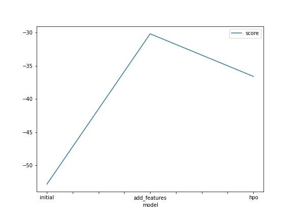
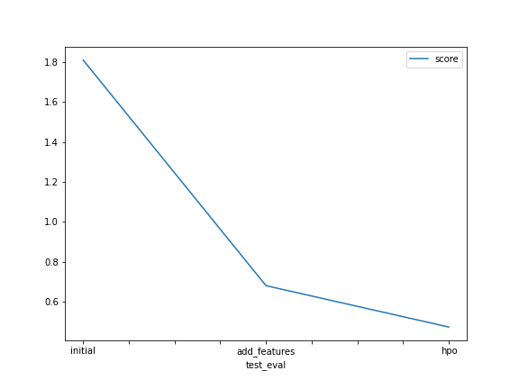

# Report: Predict Bike Sharing Demand with AutoGluon Solution
#### Mahmoud Mohamed Eisa

## Initial Training
### What did you realize when you tried to submit your predictions? What changes were needed to the output of the predictor to submit your results?
TODO: I realize that score will be bad because of training of regression model on skewed numerical features and produce bad model so we needed to changes some features and make expoloratory analysis first to select who is better for the model.

### What was the top ranked model that performed?
TODO: WeightedEnsemble_L3

## Exploratory data analysis and feature creation
### What did the exploratory analysis find and how did you add additional features?
TODO: EDA found that some numerical features in fact represent gategorical features and some numerical features have right-skewed, i add some additional features such as year, month and day from datetime column.

### How much better did your model preform after adding additional features and why do you think that is?
TODO: New model after adding additional features with converting of some features was much better in training, because of adding and editing of important features.

## Hyper parameter tuning
### How much better did your model preform after trying different hyper parameters?
TODO: I used XGBOOST hyperparameters then i have score much better with wide range.

### If you were given more time with this dataset, where do you think you would spend more time?
TODO: I think i will spend my additional time in exploratory analysis and features selection to optimize best features for the model.

### Create a table with the models you ran, the hyperparameters modified, and the kaggle score.
|model|hpo1|hpo2|hpo3|score|
|--|--|--|--|--|
|initial|3|8|20|1.81040|
|add_features|3|8|20|0.67966|
|hpo|1|8|20|0.60395|

### Create a line plot showing the top model score for the three (or more) training runs during the project.

TODO: Replace the image below with your own.

### Create a line plot showing the top kaggle score for the three (or more) prediction submissions during the project.

TODO: Replace the image below with your own.

## Summary
TODO: -In fact there is more than one way to achieve best result for model score and RMSE 
      -we can work on features selection to modify some change that can help the model 
      -or work on selction of the best model that can fit with available features 
      -with change in hyperparameters tuning to achieve best value or we can work in both together.
